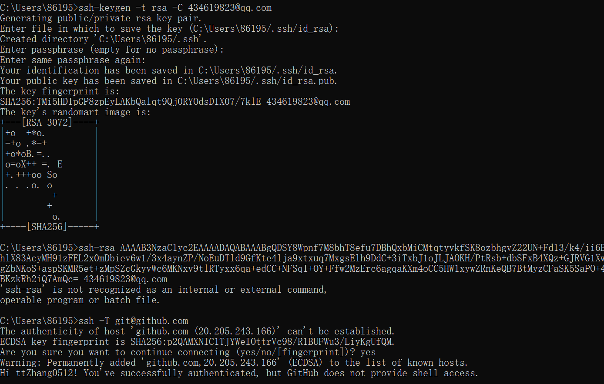
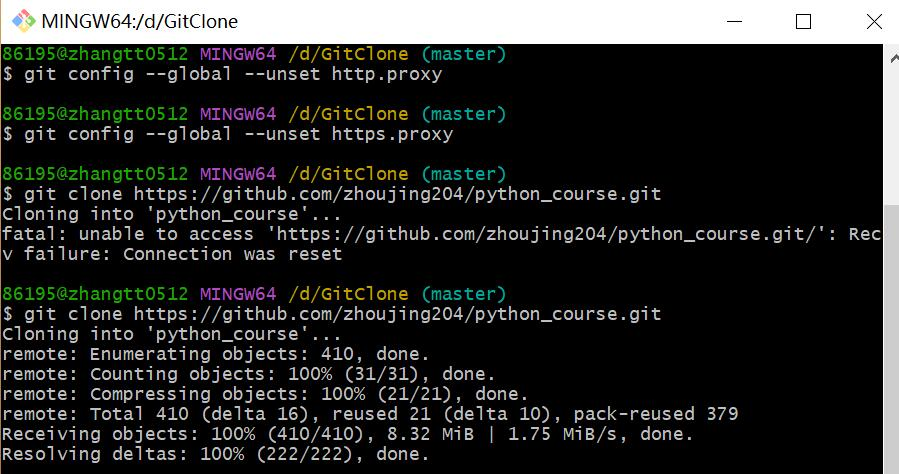
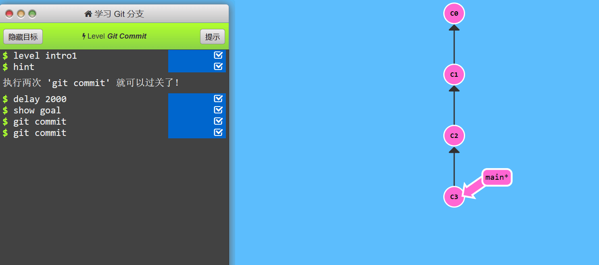
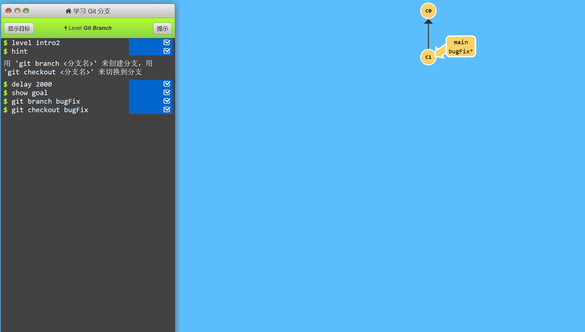
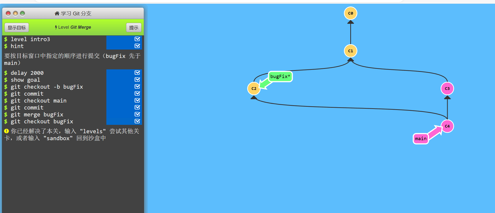
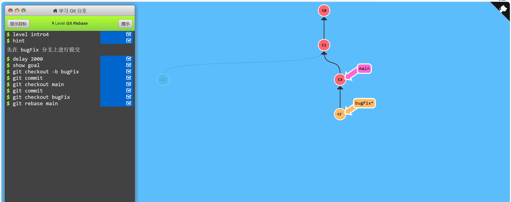
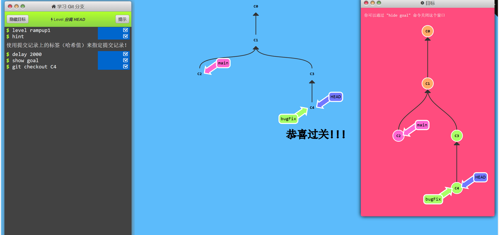
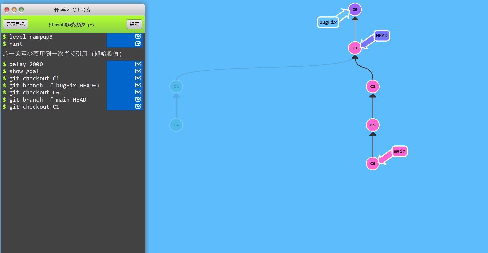
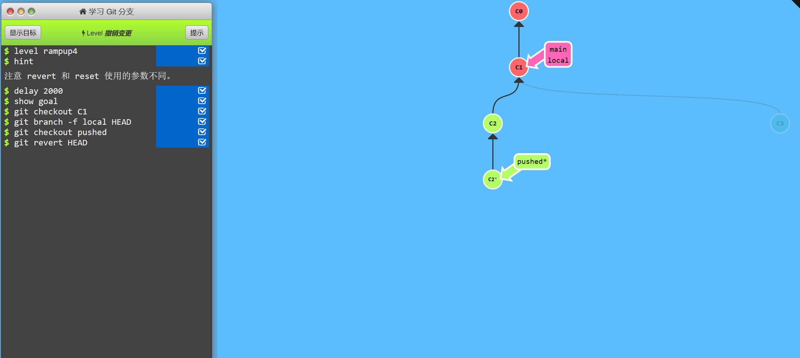

# 实验一 Git和Markdown基础

班级： 21计科04

学号： B20210301105

姓名： 张湘睿

Github地址：<https://github.com/ttZhang0512/PythonClassTasks.git>

---

## 实验目的

1. Git基础，使用Git进行版本控制
2. Markdown基础，使用Markdown进行文档编辑

## 实验环境

1. Git
2. VSCode
3. VSCode插件

## 实验内容和步骤

### 第一部分 实验环境的安装

1. 安装git，从git官网下载后直接点击可以安装：[git官网地址](https://git-scm.com/)
2. 从Github克隆课程的仓库：[课程的仓库地址](https://github.com/zhoujing204/python_course)，运行git bash应用（该应用包含在git安装包内），在命令行输入下面的命令（命令运行成功后，课程仓库会默认存放在Windows的用户文件夹下）

```bash
git clone https://github.com/zhoujing204/python_course.git
```

如果你在使用`git clone`命令时遇到SSL错误，请运行下面的git命令(这里假设你的Git使用了默认安装目录)：

```bash
git config --global http.sslCAInfo C:/Program Files/Git/mingw64/ssl/certs/ca-bundle.crt
```

该仓库的课程材料后续会有更新，如果需要更新课程材料，可以在本地课程仓库的目录下运行下面的命令：

```bash
git pull
```

3. 注册Github账号，创建一个新的仓库，用于存放实验报告和实验代码。
4. 安装VScode，下载地址：[Visual Studio Code](https://code.visualstudio.com/)
5. 安装下列VScode插件
   - GitLens
   - Git Graph
   - Git History
   - Markdown All in One
   - Markdown Preview Enhanced
   - Markdown PDF
   - Auto-Open Markdown Preview
   - Paste Image
   - markdownlint

### 第二部分 Git基础

教材《Python编程从入门到实践》P436附录D：使用Git进行版本控制，按照教材的步骤，完成Git基础的学习。

### 第三部分 learngitbranching.js.org

访问[learngitbranching.js.org](https://learngitbranching.js.org)，如下图所示完成Main部分的Introduction Sequence和Ramping Up两个小节的学习。


上面你学习到的git命令基本上可以应付百分之九十以上的日常使用，如果你想继续深入学习git，可以：

- 继续学习[learngitbranching.js.org](https://learngitbranching.js.org)后面的几个小节（包括Main和Remote）
- 在日常的开发中使用git来管理你的代码和文档，用得越多，记得越牢
- 在git使用过程中，如果遇到任何问题，例如：错误删除了某个分支、从错误的分支拉取了内容等等，请查询[git-flight-rules](https://github.com/k88hudson/git-flight-rules)

### 第四部分 Markdown基础

查看[Markdown cheat-sheet](http://www.markdownguide.org/cheat-sheet)，学习Markdown的基础语法

使用Markdown编辑器（例如VScode）编写本次实验的实验报告，包括[实验过程与结果](#实验过程与结果)、[实验考查](#实验考查)和[实验总结](#实验总结)，并将其导出为 **PDF格式** 来提交。

## 实验过程与结果

### 一、使用Git安装实验环境
#### 克隆课程仓库


#### 关联自己的仓库到github


### 二、Git基础学习——来源[learngitbranching.js.org](https://learngitbranching.js.org)
### 1.Git Commit（提交文件）
```bash
git commit 
git commit
```
### 实验一结果预览：


### 2.Git Bransh（创建分支）
```bash
git branch bugFix
git checkout bugFix
```
### 实验二结果预览：


### 3.Git Merge（合并分支）
```bash
git checkout -b bugFix
git commit
git checkout main
git commit
git merge bugFix
git checkout bugFix
```
### 实验三结果预览：


### 4.Git Rebase（覆盖原分支进行合并）
```bash
git checkout -b bugFix
git commit
git checkout main
git commit
git checkout bugFix
git rebase main
```
### 实验四结果预览：


### 5.分离HEAD（切换分支）
```bash
git checkout c4
```
### 实验五结果预览：


### 6.相对引用【 ^ 】（返回某个分支的parent）
```bash
git checkout bugFix^
```
### 实验六结果预览：


### 7.相对引用2【 ~ 】（用~<num>表示后退num步）
```bash
git checkout C1
git branch -f bugFix HEAD~1
git checkout C6
git branch -f main HEAD
git checkout C1
```
### 实验七结果预览：


### 8.Git Revert/Reset（撤销变更）
Git Reset：改写历史，向上移动分支；
Git Revert:新提交一个相同的分支，撤销原分支的更改
```bash
git checkout C1
git branch -f local HEAD
git checkout pushed 
git revert HEAD
```
### 实验八结果预览：


## 实验考查

请使用自己的语言回答下面的问题，这些问题将在实验检查时用于提问和答辩，并要求进行实际的操作。

1. 什么是版本控制？使用Git作为版本控制软件有什么优点？

   版本控制是一种管理项目源代码和文件的一种技术，它允许开发者来跟踪项目的开发历史版本，从而更好的掌握开发的进度以及更好的处理bug。

   Git是一种分布式版本控制系统，每个开发者都可以在本地拥有完整的版本库副本。

   同时它有分支系统，从而可以多个任务同时开发。

   Git还能提供快照的机制，可以有效的避免错误的出现在正式的版本。

2. 如何使用Git撤销还没有Commit的修改？如何使用Git检出（Checkout）已经提交的Commit？（实际操作）

   - 还没有`commit`的撤销

     1. ```bash 
        git checkout <filename>
        ```

     2. ```bash
        git cheeckout .(通配)
        ```

   - 已经提交的`commit`

     1. ```bash
        git checkout <提交的hash>
        ```

3. Git中的HEAD是什么？如何让HEAD处于detached HEAD状态？（实际操作）

   - 在Git中，`HEAD`是指向当前所在分支或提交的指针。它标识了当前工作树的状态。

   - 查看所有的提交记录，找到要切出的提交的提交ID。

     ```
     git log
     ```

     切换到特定的提交：

     ```
     git checkout --detach <提交ID>
     ```

4. 什么是分支（Branch）？如何创建分支？如何切换分支？（实际操作）

   - 在Git中，分支（`Branch`）是指代码库的一个独立线条，用于开发不同的功能、解决问题或并行开发。每个分支都代表了代码库的不同状态或版本。

   - 创建分支

     ```bash
     git branch <newBreachName>
     ```

   - 切换分支

     ```bash
     git checkout <branchName>
     ```

   - 创建并切换

     ```bash
     git checkout -b <newBreachName>
     ```

     

5. 如何合并分支？git merge和git rebase的区别在哪里？（实际操作）

   - 可以使用`git merge`命令或`git rebase`命令来实现分支合并。

   - `git merge`:

     确保在要合并的目标分支上：

     ```
     git checkout <目标分支>
     ```

     执行合并命令来将源分支的修改合并到目标分支：

     ```
     git merge <源分支>
     ```

   - `git rebase`:

     确保在要合并的分支上：

     ```
     git checkout <目标分支>
     ```

     执行rebase命令来将源分支的修改合并到目标分支：

     ```
     git rebase <源分支>
     ```

6. 如何在Markdown格式的文本中使用标题、数字列表、无序列表和超链接？（实际操作）

   - 标题：使用`#`，多少个`#`，代表是多少级标题。

   - 数字列表：使用`<number>. `，来生成数字列表

   - 无序列表： 使用`-  `，来生成无序列表

   - 超链接：`[nikename](hyperlink)`

## 实验总结

总结一下这次实验你学习和使用到的知识，例如：编程工具的使用、数据结构、程序语言的语法、算法、编程技巧、编程思想。  
在这次实验中我使用了Git来创建自己的代码库，并使用Git命令进行版本控制和代码管理。Git是一个分布式版本控制系统，它可以追踪文件的修改历史，并且可以方便地进行代码的分享和协作。我学习了Markdown语法，并且使用Markdown格式编写了实验报告。Markdown是一种轻量级的标记语言，它可以将文本转换为格式丰富的HTML文档，使得文档结构清晰、易读易写。在解决问题的过程中，我培养了一些编程思想，如分解问题、抽象问题、迭代求解等。这些思想可以帮助我更好地理解问题，并设计出有效的解决方案。