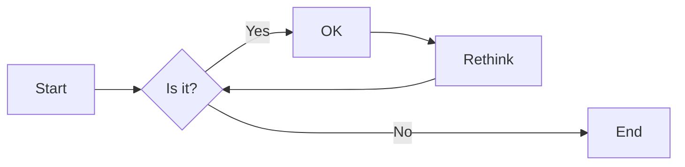
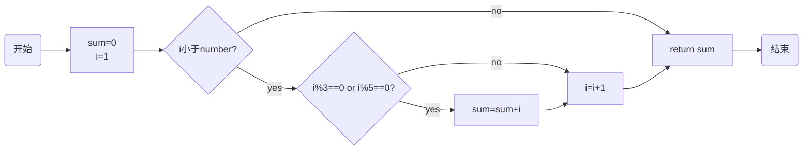
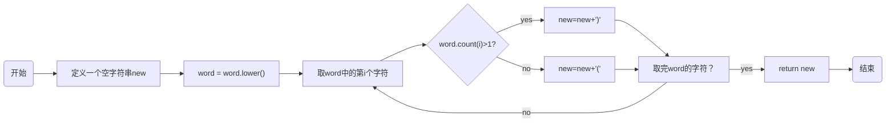
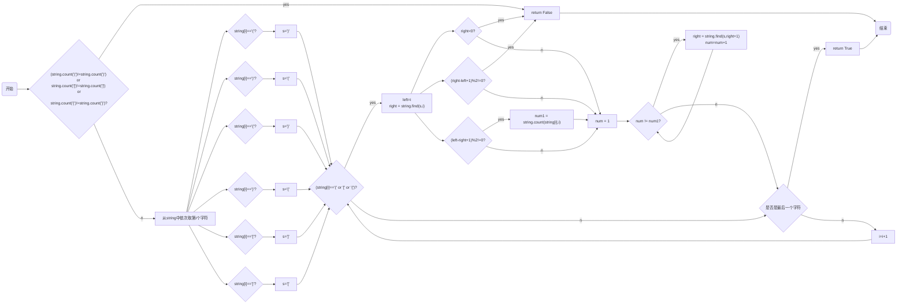

# 实验三 Python列表

班级： 21计科4

学号： 20210301105

姓名： 张湘睿

Github地址：<https://github.com/ttZhang0512/PythonClassTasks.git>

CodeWars地址：<https://www.codewars.com/users/ttZhang0512>

---

## 实验目的

1. 学习Python的简单使用和列表操作
2. 学习Python中的if语句

## 实验环境

1. Git
2. Python 3.10
3. VSCode
4. VSCode插件

## 实验内容和步骤

### 第一部分

Python列表操作

完成教材《Python编程从入门到实践》下列章节的练习：

- 第3章 列表简介
- 第4章 操作列表
- 第5章 if语句

---

### 第二部分

在[Codewars网站](https://www.codewars.com)注册账号，完成下列Kata挑战：

---

#### 第一题：3和5的倍数（Multiples of 3 or 5）

难度： 6kyu

如果列出所有低于 10 的 3 或 5 倍数的自然数，得到 3、5、6 和 9。这些数的总和为 23. 完成一个函数，使其返回小于某个整数的所有是3 或 5 的倍数的数的总和。此外，如果数字为负数，则返回 0。

注意：如果一个数同时是3和5的倍数，应该只被算一次。

**提示：首先使用列表解析得到一个列表，元素全部是3或者5的倍数。
使用sum函数可以获取这个列表所有元素的和.**

代码提交地址：
<https://www.codewars.com/kata/514b92a657cdc65150000006>

---

#### 第二题： 重复字符的编码器（Duplicate Encoder）

难度： 6kyu

本练习的目的是将一个字符串转换为一个新的字符串，如果新字符串中的每个字符在原字符串中只出现一次，则为"("，如果该字符在原字符串中出现多次，则为")"。在判断一个字符是否是重复的时候，请忽略大写字母。

例如:

```python
"din"      =>  "((("
"recede"   =>  "()()()"
"Success"  =>  ")())())"
"(( @"     =>  "))(("
```

代码提交地址:
<https://www.codewars.com/kata/54b42f9314d9229fd6000d9c>

---

#### 第三题：括号匹配（Valid Braces）

难度：6kyu

写一个函数，接收一串括号，并确定括号的顺序是否有效。如果字符串是有效的，它应该返回True，如果是无效的，它应该返回False。
例如：

```python
"(){}[]" => True 
"([{}])" => True
 "(}" => False
 "[(])" => False 
"[({})](]" => False
```

**提示：
python中没有内置堆栈数据结构，可以直接使用`list`来作为堆栈，其中`append`方法用于入栈，`pop`方法可以出栈。**

代码提交地址
<https://www.codewars.com/kata/5277c8a221e209d3f6000b56>

---

#### 第四题： 从随机三元组中恢复秘密字符串(Recover a secret string from random triplets)

难度： 4kyu

有一个不为你所知的秘密字符串。给出一个随机三个字母的组合的集合，恢复原来的字符串。

这里的三个字母的组合被定义为三个字母的序列，每个字母在给定的字符串中出现在下一个字母之前。"whi "是字符串 "whatisup "的一个三个字母的组合。

作为一种简化，你可以假设没有一个字母在秘密字符串中出现超过一次。

对于给你的三个字母的组合，除了它们是有效的三个字母的组合以及它们包含足够的信息来推导出原始字符串之外，你可以不做任何假设。特别是，这意味着秘密字符串永远不会包含不出现在给你的三个字母的组合中的字母。

测试用例：

```python
secret = "whatisup"
triplets = [
  ['t','u','p'],
  ['w','h','i'],
  ['t','s','u'],
  ['a','t','s'],
  ['h','a','p'],
  ['t','i','s'],
  ['w','h','s']
]
test.assert_equals(recoverSecret(triplets), secret)
```

代码提交地址：
<https://www.codewars.com/kata/53f40dff5f9d31b813000774/train/python>

提示：

- 利用集合去掉`triplets`中的重复字母，得到字母集合`letters`，最后的`secret`应该由集合中的字母组成，`secret`长度也等于该集合。

```python
letters = {letter for triplet in triplets for letter in triplet }
length = len(letters)
```

- 创建函数`check_first_letter(triplets, first_letter)`，检测一个字母是不是secret的首字母，返回True或者False。
- 创建函数`remove_first_letter(triplets, first_letter)`,  从三元组中去掉首字母，返回新的三元组。
- 遍历字母集合letters，利用上面2个函数得到最后的结果`secret`。

---

#### 第五题： 去掉喷子的元音（Disemvowel Trolls）

难度： 7kyu

喷子正在攻击你的评论区!
处理这种情况的一个常见方法是删除喷子评论中的所有元音(字母：a,e,i,o,u)，以消除威胁。
你的任务是写一个函数，接收一个字符串并返回一个去除所有元音的新字符串。
例如，字符串 "This website is for losers LOL!"   将变成 "Ths wbst s fr lsrs LL!".

注意：对于这个Kata来说，y不被认为是元音。
代码提交地址：
<https://www.codewars.com/kata/52fba66badcd10859f00097e>

提示：

- 首先使用列表解析得到一个列表，列表中所有不是元音的字母。
- 使用字符串的join方法连结列表中所有的字母，例如：

```python
last_name = "lovelace"
letters = [letter for letter in last_name ]
print(letters) # ['l', 'o', 'v', 'e', 'l', 'a', 'c', 'e']
name = ''.join(letters) # name = "lovelace"
```

---

### 第三部分

使用Mermaid绘制程序流程图

安装VSCode插件：

- Markdown Preview Mermaid Support
- Mermaid Markdown Syntax Highlighting

使用Markdown语法绘制你的程序绘制程序流程图（至少一个），Markdown代码如下：


显示效果如下：



查看Mermaid流程图语法-->[点击这里](https://mermaid.js.org/syntax/flowchart.html)

使用Markdown编辑器（例如VScode）编写本次实验的实验报告，包括[实验过程与结果](#实验过程与结果)、[实验考查](#实验考查)和[实验总结](#实验总结)，并将其导出为 **PDF格式** 来提交。

## 实验过程与结果

请将实验过程与结果放在这里，包括：

### - [第一部分 Python列表操作和if语句](#第一部分)

### - [第二部分 Codewars Kata挑战](#第二部分)

#### 第一题-3和5的倍数（Multiples of 3 or 5）实验代码

```python
def solution(number):
  sum = 0
  i=1
  while(i<number):
    if(i%3==0 or i%5==0):
      sum+=i
    i+=1
  return sum
```

---

#### 第二题-重复字符的编码器（Duplicate Encoder）实验代码

```python
def duplicate_encode(word):
  new = ""
  word = word.lower()
  for i in word:
    if word.count(i)>1:
      new=new+')'
    else:
      new=new+'('
  return new
```

---

#### 第三题-括号匹配（Valid Braces）实验代码

```python
def valid_braces(string):
  if (string.count('(')!=string.count(')') or string.count('[')!=string.count(']') or string.count('{')!=string.count('}')):
    return False
  for i in range(len(string)):
    if(string[i]=='('): s=')'
    if(string[i]=='['): s=']'
    if(string[i]=='{'): s='}'
    if(string[i]==')'): s='('
    if(string[i]==']'): s='['
    if(string[i]=='}'): s='{'    
    if(string[i]=='(' or string[i]=='[' or string[i]=='{'):
      left = i
      right = string.find(s,i)
      if(right<0):
        return False
      if(left-right+1)%2!=0:
        num1 = string.count(string[i],i)
        num = 1
        while(num != num1):
          right = string.find(s,right+1)
          num+=1
        if((right-left+1)%2!=0):
          return False
  return True    
```

---

#### 第四题-从随机三元组中恢复秘密字符串(Recover a secret string from random triplets)实验代码

```python
def recoverSecret(triplets):
    'triplets is a list of triplets from the secrent string. Return the string.'
    lic = []
    for i in range(len(triplets)):
        for j in range(len(triplets[i])):
            lic.append(triplets[i][j])
 
    lic = set(lic)
    lic = list(lic)
    while True:
        cnt = 0
        for i in range(len(triplets)):
            for j in range(len(triplets[i]) - 1):
                a = triplets[i][j]
                b = triplets[i][j + 1]
                index_a = lic.index(a)
                index_b = lic.index(b)
                if index_a > index_b:
                    temp = lic[index_b]
                    lic[index_b] = lic[index_a]
                    lic[index_a] = temp
                    cnt += 1
        if cnt == 0:
            return ''.join(lic)
```

---

#### 第五题-去掉喷子的元音（Disemvowel Trolls）实验代码

```python
def disemvowel(string_):
    string_ = string_.replace("a","")
    string_ = string_.replace("A","")
    string_ = string_.replace("e","")
    string_ = string_.replace("E","")
    string_ = string_.replace("i","")
    string_ = string_.replace("I","")
    string_ = string_.replace("o","")
    string_ = string_.replace("O","")
    string_ = string_.replace("u","")
    string_ = string_.replace("U","")
    return string_  
```

---

### - [第三部分 使用Mermaid绘制程序流程图](#第三部分)

#### 第一题-3和5的倍数（Multiples of 3 or 5）实验流程图



---

#### 第二题-重复字符的编码器（Duplicate Encoder）实验流程



---

#### 第三题-括号匹配（Valid Braces）实验流程



---

## 实验考查

请使用自己的语言并使用尽量简短代码示例回答下面的问题，这些问题将在实验检查时用于提问和答辩以及实际的操作。

1. Python中的列表可以进行哪些操作？  
  （1）添加元素：使用append()方法在列表末尾添加元素，使用insert()方法在指定位置插入元素。  
  （2）访问元素：使用索引访问列表中的元素，索引从0开始。也可以使用切片操作获取列表的子列表。  
  （3）修改元素：通过索引对列表中的元素进行赋值操作。  
  （4）删除元素：使用remove()方法删除指定值的元素，使用pop()方法删除指定索引位置的元素。  
  （5）长度和计数：使用len()函数获取列表的长度，使用count()方法统计指定值在列表中出现的次数。  
  （6）列表拼接和重复：使用+运算符进行列表拼接，使用*运算符进行列表重复。  
  （7）列表判空：使用not运算符或条件判断语句判断列表是否为空。  
  （8）其他操作：包括列表的迭代、排序、查找最大/最小值等。
2. 哪两种方法可以用来对Python的列表排序？这两种方法有和区别？  
  使用sort()方法：该方法会直接修改原始列表，在原地进行排序。可以指定参数 reverse=True 实现降序排序。使用sorted()函数：该函数会返回一个新的已排序列表，不会修改原始列表。同样可以指定参数 reverse=True 实现降序排序。这两种方法的主要区别在于对原始列表的影响。sort()方法会直接修改原始列表，而sorted()函数会返回一个新的已排序列表。如果需要保留原始列表的顺序，可以使用sorted()函数；如果希望在原地排序并修改原始列表，可以使用sort()方法。
3. 如何将Python列表逆序打印？  
  若要将Python列表逆序打印，可以使用切片操作和步长为-1。
4. Python中的列表执行哪些操作时效率比较高？哪些操作效率比较差？是否有类似的数据结构可以用来替代列表？  

- 列表执行以下操作时效率较高：

  （1）添加/删除元素：在列表末尾添加元素的操作效率较高，使用append()方法。  
  （2）访问元素：通过索引访问列表中的元素的操作效率较高。  
- 列表执行以下操作时效率较低：  
  （1）插入/删除元素：在列表中间插入或删除元素的操作效率较低，因为需要移动其他元素。  
  （2）切片操作：使用切片操作得到一个新的子列表时，会涉及到创建新的列表对象和复制元素，效率较低。  
- 使用链表（linked list）这种数据结构可以替代列表。
  
5. 阅读《Fluent Python》Chapter 2. An Array of Sequence - Tuples Are Not Just Immutable Lists小节（p30-p35）。总结该小节的主要内容。  
  这一小节介绍了元组的基本概念、用途和特点。元组是不可变的序列类型，与列表相似但具有不同的特性。可以用于表示固定长度的记录，也可以用于在函数之间传递多个值；元组通过解包可以将元素赋值给多个变量；元祖可以用作字典的键。具名元组是一种创建带有字段名的元组的方法，可以通过字段名访问元组中的元素。另外，切片操作可以用于元组和列表，但结果始终是一个新的对象。


## 实验总结

总结一下这次实验你学习和使用到的知识，例如：编程工具的使用、数据结构、程序语言的语法、算法、编程技巧、编程思想。  
通过学习Python中的列表和if语句实验，我掌握了列表、字典这两类数据结构，学到了列表的创建、访问和修改元素、切片操作、添加和删除元素等基本操作，使用字典来存储和操作简单数据等。还学习了Python的语法规则和语法结构，如变量命名、赋值语句、条件语句、循环语句等。然后，还学会了一些简单的算法，如列表排序、条件判断、循环迭代等。除此之外，我逐渐掌握了条件语句（if语句）的使用，根据条件执行不同的代码块；使用列表解析来简化对列表的操作和处理，合理使用if语句来处理不同的情况，以及使用逻辑运算符组合多个条件等编程技巧。另外，我开始有了根据需求设计和实现算法的思维。
