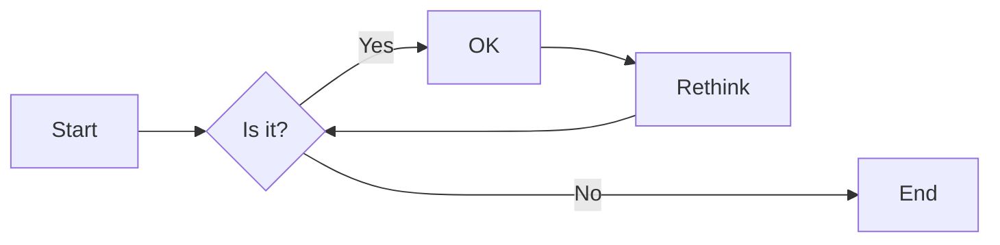

# 实验二 Python变量、简单数据类型

班级： 21计科4班

学号： 20210301105

姓名： 张湘睿

Github地址：<https://github.com/ttZhang0512/PythonClassTasks.git>

CodeWars地址：<https://www.codewars.com/users/ttZhang0512>

---

## 实验目的

1. 使用VSCode编写和运行Python程序
2. 学习Python变量和简单数据类型

## 实验环境

1. Git
2. Python 3.10
3. VSCode
4. VSCode插件

## 实验内容和步骤

### 第一部分

实验环境的安装

1. 安装Python，从Python官网下载Python 3.10安装包，下载后直接点击可以安装：[Python官网地址](https://www.python.org/downloads/)
2. 为了在VSCode集成环境下编写和运行Python程序，安装下列VScode插件
   - Python
   - Python Environment Manager
   - Python Indent
   - Python Extended
   - Python Docstring Generator
   - Jupyter
   - indent-rainbow
   - Jinja

---

### 第二部分

Python变量、简单数据类型和列表简介

完成教材《Python编程从入门到实践》下列章节的练习：

- 第2章 变量和简单数据类型s

---

### 第三部分

在[Codewars网站](https://www.codewars.com)注册账号，完成下列Kata挑战：

---

#### 第1题：求离整数n最近的平方数（Find Nearest square number）

难度：8kyu

你的任务是找到一个正整数n的最近的平方数
例如，如果n=111，那么nearest_sq(n)（nearestSq(n)）等于121，因为111比100（10的平方）更接近121（11的平方）。
如果n已经是完全平方（例如n=144，n=81，等等），你需要直接返回n。
代码提交地址
<https://www.codewars.com/kata/5a805d8cafa10f8b930005ba>

---

#### 第2题：弹跳的球（Bouncing Balls）

难度：6kyu

一个孩子在一栋高楼的第N层玩球。这层楼离地面的高度h是已知的。他把球从窗口扔出去。球弹了起来,  例如:弹到其高度的三分之二（弹力为0.66）。他的母亲从离地面w米的窗户向外看,母亲会看到球在她的窗前经过多少次（包括球下落和反弹的时候）？

一个有效的实验必须满足三个条件：

- 参数 "h"（米）必须大于0
- 参数 "bounce "必须大于0且小于1
- 参数 “window "必须小于h。

如果以上三个条件都满足，返回一个正整数，否则返回-1。
**注意:只有当反弹球的高度严格大于窗口参数时，才能看到球。**
代码提交地址
<https://www.codewars.com/kata/5544c7a5cb454edb3c000047/train/python>

---

#### 第3题： 元音统计(Vowel Count)

难度： 7kyu

返回给定字符串中元音的数量（计数）。对于这个Kata，我们将考虑a、e、i、o、u作为元音（但不包括y）。输入的字符串将只由小写字母和/或空格组成。

代码提交地址：
<https://www.codewars.com/kata/54ff3102c1bad923760001f3>

---

#### 第4题：偶数或者奇数（Even or Odd）

难度：8kyu

创建一个函数接收一个整数作为参数，当整数为偶数时返回”Even”当整数位奇数时返回”Odd”。
代码提交地址：
<https://www.codewars.com/kata/53da3dbb4a5168369a0000fe>

### 第四部分

使用Mermaid绘制程序流程图

安装Mermaid的VSCode插件：

- Markdown Preview Mermaid Support
- Mermaid Markdown Syntax Highlighting

使用Markdown语法绘制你的程序绘制程序流程图（至少一个），Markdown代码如下：


显示效果如下：



查看Mermaid流程图语法-->[点击这里](https://mermaid.js.org/syntax/flowchart.html)

## 实验过程与结果

请将实验过程与结果放在这里，包括：

- [第二部分 Python变量、简单数据类型和列表简介](#第二部分)
- [第三部分 Codewars Kata挑战](#第三部分)
- [第四部分 使用Mermaid绘制程序流程图](#第四部分)  

### 第二部分 Python变量、简单数据类型和列表简介  

#### 第一题实验代码

  ```python
import math
def nearest_sq(n):
    num2 = (int)(math.sqrt(n))
    gap = (int)(math.fabs(n-num2*num2))
    if gap==0: 
        return num2*num2
    gap2 = (int)(math.fabs(n-(num2+1)*(num2+1)))
    if gap2<gap:
        num2 = num2+1
    return num2*num2
  ```  

---

#### 第二题实验代码

```python
def bouncing_ball(h, bounce, window):
    if(h<=window or h<=0 or bounce<=0 or bounce>=1): return -1
    exp = 1
    h = h*bounce
    while(h>window):
        exp += 2
        h = h*bounce
    return exp
```  

---

#### 第三题实验代码

```python
def get_count(sentence):
    count = 0
    count = sentence.count('a')+sentence.count('e')+sentence.count('i')+sentence.count('o')+sentence.count('u')
    return count
```

#### 第四题实验代码

```python
import math
def even_or_odd(number):
    if math.fabs(number)%2==0: 
        return "Even"
    else:
        return "Odd"  
```

## 实验考查

请使用自己的语言并使用尽量简短代码示例回答下面的问题，这些问题将在实验检查时用于提问和答辩以及实际的操作。

1. Python中的简单数据类型有那些？我们可以对这些数据类型做哪些操作？  
   Python中的简单数据类型包括整型（int）、浮点型（float）、布尔型（bool）和字符串（str）。我们可以对这些数据类型进行加法、减法、乘法和除法等算术运算；比较大小；逻辑运算（与、或、非）；字符串拼接、切片等操作。
2. 为什么说Python中的变量都是标签？  
   在Python中，变量实际上是对对象的引用，也称作标签。当我们将一个值赋给一个变量时，实际上是将这个值的内存地址赋给了变量。因此，我们可以通过变量来访问和操作这个值。
3. 有哪些方法可以提高Python代码的可读性？  
   使用有意义的变量名和函数名；提高代码编写的规范性，合理安排代码块和缩进等；添加注释，解释代码的功能和原理；保持代码结构清晰，模块化，避免过长的函数和复杂的逻辑编写单元测试和集成测试，确保代码的正确性和稳定性。

## 实验总结

总结一下这次实验你学习和使用到的知识，例如：编程工具的使用、数据结构、程序语言的语法、算法、编程技巧、编程思想。  
在本次实验中，我通过编写代码来实践和掌握了Python的基本语法规则，加深了对Python语言的理解，了解了Python中的不同数据类型，如整数（int）、浮点数（float）、字符串（str）和布尔值（bool），以及如何声明和使用变量。然后，我学习到了Python中的常用运算符，如算术运算符（+、-、*、/、%、**）、比较运算符（==、！=、>、<、>=、<=）和逻辑运算符（and、or、not）。除此之外，我还学习到了Python中的控制流程语句，如条件语句（if-else）、循环语句（for、while）和异常处理（try-except）等。
