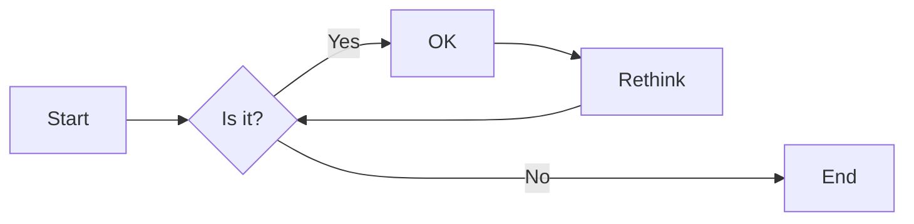
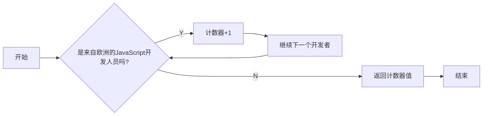
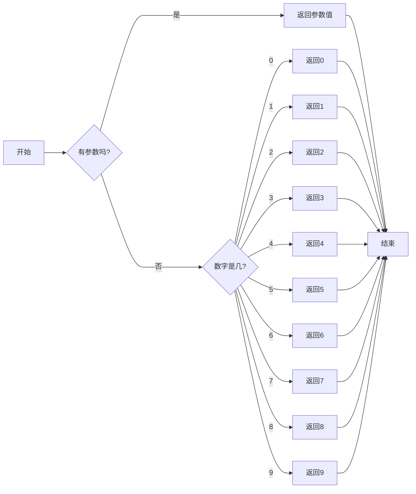
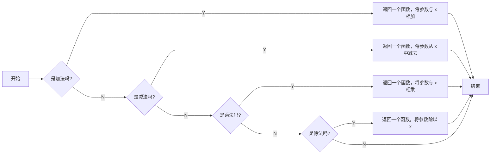
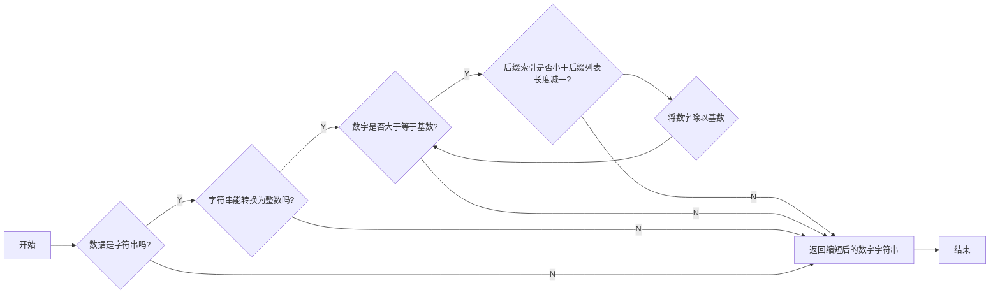
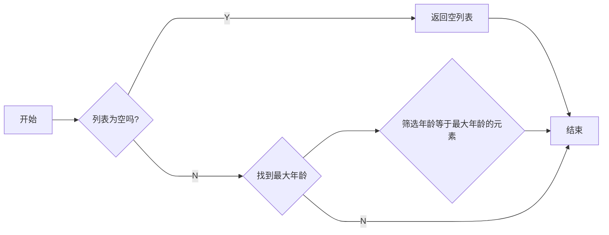

# 实验六 Python函数

班级： 21计科4

学号： 20210301105

姓名： 张湘睿

Github地址：<https://github.com/ttZhang0512/PythonClassTasks.git>

CodeWars地址：<https://www.codewars.com/users/ttZhang0512>

---

## 实验目的

1. 学习Python函数的基本用法
2. 学习lambda函数和高阶函数的使用
3. 掌握函数式编程的概念和实践

## 实验环境

1. Git
2. Python 3.10
3. VSCode
4. VSCode插件

## 实验内容和步骤

### 第一部分

Python函数

完成教材《Python编程从入门到实践》下列章节的练习：

- 第8章 函数

---

### 第二部分

在[Codewars网站](https://www.codewars.com)注册账号，完成下列Kata挑战：

---

#### 第一题：编码聚会1

难度： 7kyu

你将得到一个字典数组，代表关于首次报名参加你所组织的编码聚会的开发者的数据。
你的任务是返回来自欧洲的JavaScript开发者的数量。
例如，给定以下列表：

```python
lst1 = [
  { 'firstName': 'Noah', 'lastName': 'M.', 'country': 'Switzerland', 'continent': 'Europe', 'age': 19, 'language': 'JavaScript' },
  { 'firstName': 'Maia', 'lastName': 'S.', 'country': 'Tahiti', 'continent': 'Oceania', 'age': 28, 'language': 'JavaScript' },
  { 'firstName': 'Shufen', 'lastName': 'L.', 'country': 'Taiwan', 'continent': 'Asia', 'age': 35, 'language': 'HTML' },
  { 'firstName': 'Sumayah', 'lastName': 'M.', 'country': 'Tajikistan', 'continent': 'Asia', 'age': 30, 'language': 'CSS' }
]
```

你的函数应该返回数字1。
如果，没有来自欧洲的JavaScript开发人员，那么你的函数应该返回0。

注意：
字符串的格式将总是"Europe"和"JavaScript"。
所有的数据将始终是有效的和统一的，如上面的例子。

这个卡塔是Coding Meetup系列的一部分，其中包括一些简短易行的卡塔，这些卡塔是为了让人们掌握高阶函数的使用。在Python中，这些方法包括：`filter`, `map`, `reduce`。当然也可以采用其他方法来解决这些卡塔。

[代码提交地址](https://www.codewars.com/kata/coding-meetup-number-1-higher-order-functions-series-count-the-number-of-javascript-developers-coming-from-europe)

---

#### 第二题： 使用函数进行计算

难度：5kyu

这次想用函数来写计算，并得到结果。让看一下一些例子：

```python
seven(times(five())) # must return 35
four(plus(nine())) # must return 13
eight(minus(three())) # must return 5
six(divided_by(two())) # must return 3
```

要求：

- 从0（"零"）到9（"九"）的每个数字都必须有一个函数。
- 必须有一个函数用于以下数学运算：加、减、乘、除。
- 每个计算都由一个操作和两个数字组成。
- 最外面的函数代表左边的操作数，最里面的函数代表右边的操作数。
- 除法应该是整数除法。

例如，下面的计算应该返回2，而不是2.666666...。

```python
eight(divided_by(three()))
```

代码提交地址：
<https://www.codewars.com/kata/525f3eda17c7cd9f9e000b39>

---

#### 第三题： 缩短数值的过滤器(Number Shortening Filter)

难度：6kyu

在这个kata中，将创建一个函数，它返回另一个缩短长数字的函数。给定一个初始值数组替换给定基数的 X 次方。如果返回函数的输入不是数字字符串，则应将输入本身作为字符串返回。

例子：

```python
filter1 = shorten_number(['','k','m'],1000)
filter1('234324') == '234k'
filter1('98234324') == '98m'
filter1([1,2,3]) == '[1,2,3]'
filter2 = shorten_number(['B','KB','MB','GB'],1024)
filter2('32') == '32B'
filter2('2100') == '2KB';
filter2('pippi') == 'pippi'
```

代码提交地址：
<https://www.codewars.com/kata/56b4af8ac6167012ec00006f>

---

#### 第四题： 编码聚会7

难度： 6kyu

您将获得一个对象序列，表示已注册参加您组织的下一个编程聚会的开发人员的数据。

您的任务是返回一个序列，其中包括最年长的开发人员。如果有多个开发人员年龄相同，则将他们按照在原始输入数组中出现的顺序列出。

例如，给定以下输入数组：

```python
list1 = [
  { 'firstName': 'Gabriel', 'lastName': 'X.', 'country': 'Monaco', 'continent': 'Europe', 'age': 49, 'language': 'PHP' },
  { 'firstName': 'Odval', 'lastName': 'F.', 'country': 'Mongolia', 'continent': 'Asia', 'age': 38, 'language': 'Python' },
  { 'firstName': 'Emilija', 'lastName': 'S.', 'country': 'Lithuania', 'continent': 'Europe', 'age': 19, 'language': 'Python' },
  { 'firstName': 'Sou', 'lastName': 'B.', 'country': 'Japan', 'continent': 'Asia', 'age': 49, 'language': 'PHP' },
]
```

您的程序应该返回如下结果：

```python
[
  { 'firstName': 'Gabriel', 'lastName': 'X.', 'country': 'Monaco', 'continent': 'Europe', 'age': 49, 'language': 'PHP' },
  { 'firstName': 'Sou', 'lastName': 'B.', 'country': 'Japan', 'continent': 'Asia', 'age': 49, 'language': 'PHP' },
]
```

注意：

- 输入的列表永远都包含像示例中一样有效的正确格式的数据，而且永远不会为空。

代码提交地址：
<https://www.codewars.com/kata/582887f7d04efdaae3000090>

---

### 第三部分

使用Mermaid绘制程序流程图

安装VSCode插件：

- Markdown Preview Mermaid Support
- Mermaid Markdown Syntax Highlighting

使用Markdown语法绘制你的程序绘制程序流程图（至少一个），Markdown代码如下：


显示效果如下：



## 实验过程与结果

请将实验过程与结果放在这里，包括：

- [第一部分 Python函数](#第一部分)
- [第二部分 Codewars Kata挑战](#第二部分)

### 第一题实现代码

```python
def count_developers(lst):
  coders = [i for i in lst if i['continent']=='Europe' and i['language']=='JavaScript']
  return len(coders)
```

### 第二题实现代码

```python
def zero(num=None): return 0 if num==None else num(0)
def one(num=None): return 1 if num==None else num(1)
def two(num=None): return 2 if num==None else num(2)
def three(num=None): return 3 if num==None else num(3)
def four(num=None): return 4 if num==None else num(4)
def five(num=None): return 5 if num==None else num(5)
def six(num=None): return 6 if num==None else num(6)
def seven(num=None): return 7 if num==None else num(7)
def eight(num=None): return 8 if num==None else num(8)
def nine(num=None): return 9 if num==None else num(9)


def plus(y): return lambda x: int(x+y)
def minus(y): return lambda x: int(x-y)
def times(y): return lambda  x: int(x*y)
def divided_by(y): return lambda  x: int(x/y)
```

### 第三题实现代码

```python
def shorten_number(suffixes, base):
  def my_filter(data):
    if not isinstance(data, str):   #字符类型判断
      return str(data)
    try:
        number = int(data)
    except ValueError:
      return str(data)

    i = 0
    while number // base > 0 and i < len(suffixes) - 1:
      number //= base
      i += 1

    return str(number) + suffixes[i]

  return my_filter
```

### 第四题实现代码

```python
def find_senior(lst): 
  max_age = max(lst, key=lambda x: x['age'])['age']
  return [x for x in lst if x['age'] == max_age]
```

- [第三部分 使用Mermaid绘制程序流程图](#第三部分)


#### 第一题流程图



#### 第二题流程图





#### 第三题流程图



#### 第四题流程图



## 实验考查

请使用自己的语言并使用尽量简短代码示例回答下面的问题，这些问题将在实验检查时用于提问和答辩以及实际的操作。

1. 什么是函数式编程范式？  
  函数式编程范式是一种编程范式，它将计算视为函数应用的连续组合。它强调使用纯函数（没有副作用）和不可变数据来进行编程，以实现更简洁、可维护和可扩展的代码。

2. 什么是lambda函数？请举例说明。  
  Lambda函数是一种匿名函数，它可以在需要函数的地方被直接定义和使用。它通常用于简化代码和处理简单的功能。例如，在Python中，可以使用lambda函数来定义一个简单的加法函数：

```python
add = lambda x, y: x + y
result = add(3, 5)
print(result)  # 输出：8
```

3. 什么是高阶函数？常用的高阶函数有哪些？这些高阶函数如何工作？使用简单的代码示例说明。  
  高阶函数是指能够接受其他函数作为参数或返回函数作为结果的函数。常用的高阶函数包括`map`、`filter`和`reduce`。这些高阶函数通过对集合中的元素进行操作来实现功能。

- map函数接受一个函数和一个可迭代对象，并对可迭代对象中的每个元素应用该函数，返回一个新的可迭代对象。例如，在Python中，可以使用`map`函数将列表中的每个元素加倍：

```python
numbers = [1, 2, 3, 4, 5]
doubled_numbers = list(map(lambda x: x * 2, numbers))
print(doubled_numbers)  # 输出：[2, 4, 6, 8, 10]
```

- filter函数接受一个函数和一个可迭代对象，并根据函数的返回值来过滤可迭代对象中的元素，返回一个新的可迭代对象。例如，在Python中，可以使用`filter`函数筛选出列表中的偶数：
  
```python
numbers = [1, 2, 3, 4, 5]
even_numbers = list(filter(lambda x: x % 2 == 0, numbers))
print(even_numbers)  # 输出：[2, 4]
```

- reduce函数接受一个函数和一个可迭代对象，并将可迭代对象中的元素依次合并为一个结果。例如，在Python中，可以使用`reduce`函数计算列表中所有元素的累加和：

```python
from functools import reduce
numbers = [1, 2, 3, 4, 5]
sum = reduce(lambda x, y: x + y, numbers)
print(sum)  # 输出：15
```

## 实验总结

总结一下这次实验你学习和使用到的知识，例如：编程工具的使用、数据结构、程序语言的语法、算法、编程技巧、编程思想。  
  在这次实验中，我学习了一些算法的概念和实现方式，例如使用循环和递归来解决问题。我还学习了一些常见的算法问题，如排序和搜索算法。我还学习到了一些编程技巧，如代码重用、模块化编程和错误处理等。这些技巧帮助我编写更高效、可维护和可扩展的代码。同时，我掌握了函数式编程的概念和实践。函数式编程强调使用纯函数和不可变数据来进行编程，以实现更简洁、可维护和可扩展的代码。还了解了如何使用lambda函数和高阶函数来实现函数式编程的思想。总结起来，这次实验让我掌握了Python函数的基本用法，学习了lambda函数和高阶函数的使用，并了解了函数式编程的概念和实践。这些知识使我能够更好地编写Python代码，并且拓宽了我的编程思维和技能。
