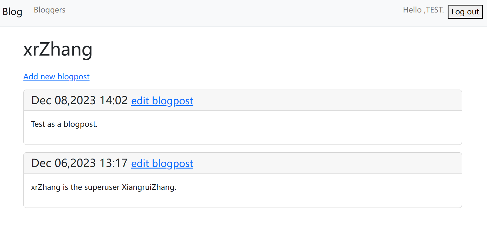

# 《Python程序设计基础》程序设计作品说明书

题目： 学习笔记Web应用程序🕸️

学院： 21计科04

姓名： 张湘睿

学号： B20210301105

指导教师： 周景

起止日期：2023.11.10-2023.12.10

## 摘要

本次实验实现了两个Python Web应用程序：一个是学习笔记的Web应用程序，另一个是基于Django框架的博客系统。在学习笔记应用程序中，成功实现了创建Web应用程序、学习笔记主页、其他页面的功能，并为用户提供了数据输入、账户创建和个性化学习笔记样式的能力。同时，在博客项目中，引入了用户登录和注册系统，使用Bootstrap框架为博客系统设计了精美的样式。通过这次实验，我深入了解了Python Web开发的基本原理，掌握了Django框架的使用，并成功搭建了两个功能强大、用户友好的Web应用程序。

**关键词：** Python, Web应用程序, Django框架, 学习笔记, 博客系统, 用户登录, Bootstrap

## 第1章 需求分析

### 1.1 项目背景

本项目的背景是为了满足用户在学习和记录知识过程中的需求，提供便捷的学习笔记管理和博客分享功能。通过两个独立但相互关联的Web应用程序，用户可以创建个性化的学习笔记并分享自己的见解和经验。

### 1.2 功能需求

#### 1.2.1 学习笔记应用程序

1. 用户账户管理：用户能够注册新账户、登录、注销。
2. 笔记创建与编辑：用户可以创建新的学习笔记，并对现有笔记进行编辑。
3. 样式设置：用户可以个性化设置学习笔记的样式，以满足个人喜好和需求。
4. 数据输入：提供用户友好的界面，方便用户输入和管理学习笔记的内容。

#### 1.2.2 博客系统

1. 用户认证：用户可以注册账户、登录、注销。
2. 博客创建与编辑：用户可以创建新的博客文章，并对已有文章进行编辑。
3. 用户个人页面：每个用户都有一个个人页面，展示其发布的博客文章。
4. 界面美化：使用Bootstrap框架设计博客系统的用户界面，提高用户体验。

### 1.3 用户问题解决

1. 通过学习笔记应用程序，用户能够高效地记录和管理个人学习过程中的知识点。
2. 博客系统为用户提供了一个展示和分享自己见解的平台，促进学习交流和知识传播。

## 第2章 分析与设计

### 2.1 系统架构

#### 2.1.1 学习笔记应用程序

系统采用典型的三层架构，包括前端、后端和数据库。

- **前端：** 使用HTML构建用户界面，提供学习笔记的创建、编辑和样式设置功能。
  
- **后端：** 基于Django框架，处理前端请求，管理用户认证、笔记创建和编辑等业务逻辑。

- **数据库：** 使用Django自带的ORM工具，选择数据库存储用户账户信息和学习笔记内容。

#### 2.1.2 博客系统

博客系统同样采用三层架构。

- **前端：** 利用Bootstrap框架美化用户界面，提供博客文章的创建和编辑功能。

- **后端：** 同样基于Django框架，处理用户认证、博客文章的管理和展示。

- **数据库：** 使用Django ORM工具，将用户信息和博客文章存储于数据库中。

### 2.2 系统流程

#### 2.2.1 学习笔记应用程序

1. 用户注册与登录流程：
   - 用户通过前端页面注册新账户。
   - 系统验证并存储用户信息。
   - 注册成功后，用户自动登录。

2. 笔记创建与编辑流程：
   - 登录后，用户可以创建新的学习笔记或编辑已有笔记。
   - 用户可以通过界面进行样式设置。

#### 2.2.2 博客系统

1. 用户认证流程：
   - 用户注册或登录。
   - 系统验证用户身份。
   - 注册成功后，用户自动登录。

2. 博客创建与编辑流程：
   - 登录后，用户可以创建新的博客文章或编辑已有文章。
   - 博客文章包括标题、内容等信息。

3. 用户个人页面流程：
   - 每个用户有一个独立的个人页面，展示其发布的博客文章。

### 2.3 系统模块

#### 2.3.1 学习笔记应用程序

1. **用户管理模块：** 处理用户注册、登录、注销的功能。

2. **笔记管理模块：** 管理学习笔记的创建、编辑和样式设置。

#### 2.3.2 博客系统

1. **用户认证模块：** 处理用户注册、登录、注销的功能。

2. **博客管理模块：** 管理博客文章的创建和编辑。

3. **个人页面模块：** 展示用户个人信息和发布的博客文章。

### 2.4 数据库设计

#### 2.4.1 学习笔记应用程序

1. **User表：**
   - 用户ID
   - 用户名
   - 密码（加密存储）

2. **Note表：**
   - 笔记ID
   - 用户ID（外键）
   - 笔记标题
   - 笔记内容
   - 样式设置

#### 2.4.2 博客系统

1. **User表：**
   - 用户ID
   - 用户名
   - 密码（加密存储）

2. **Blog表：**
   - 博客ID
   - 用户ID（外键）
   - 博客标题
   - 博客内容

### 2.5 关键实现技术

1. **Django框架：** 用于构建Web应用程序的后端逻辑。
2. **Bootstrap框架：** 用于美化Web应用程序的前端界面。
3. **Django ORM：** 用于数据库操作，实现数据的持久化存储。
4. **用户认证系统：** Django自带的用户认证系统，用于处理用户注册、登录等功能。

通过以上分析与设计，建立了清晰的系统架构和流程，并明确了关键模块和数据库设计。接下来的章节将详细介绍实际的代码实现过程。

## 第3章 软件测试

在本项目中，采用实现功能测试来验证系统的各个组成部分，包括类和函数。通过单元测试，可以确保每个模块都按照预期工作，减少潜在的错误和问题。

### 3.1 学习笔记应用程序单元测试

1. **用户管理模块测试：** 针对用户注册、登录、注销功能编写测试用例，确保用户管理模块的正常运作。

- 项目主界面  
  
    

- 进入项目注册界面
    

- 注册成功，进入该用户登录界面
  

- 注销登录，返回主界面  

2. **笔记管理模块测试：** 编写测试用例，验证笔记的创建、编辑和样式设置功能是否正确实现。

- 进入Topics主界面
  
  

- 新建Topic
  
  

- 进入其中一个Topic的详细界面
  

- 为Topic加入新信息
    
    

- 编辑修改Topic具体信息  
  
  

### 3.2 博客系统单元测试

1. **用户认证模块测试：** 编写测试用例，验证用户注册、登录和注销功能的正确性。  

- 项目主界面  
    

- 进入项目注册界面
    

- 注册成功，进入该用户登录界面
  

- 注销登录，返回主界面  

2. **博客管理模块测试：** 针对博客文章的创建和编辑功能编写测试用例，确保博客系统的正常运行。

- 进入Bloggers主界面
  

- 新建Blogger
  
  

- 进入其中一个Blogger的详细界面
  

- 为Blogger加入新BlogPost
    
    

- 编辑修改BlogPost  
  
  

## 结论

通过本次实验，成功设计并实现了两个Python Web应用程序：学习笔记应用程序和博客系统。以下是对项目的总结和结论：

### 1. 实现的功能

#### 1.1 学习笔记应用程序

- **用户管理：** 用户可以注册新账户、登录和注销。
- **笔记管理：** 用户能够创建、编辑学习笔记，并自定义笔记样式。

#### 1.2 博客系统

- **用户认证：** 用户可以注册新账户、登录和注销。
- **博客管理：** 用户能够创建、编辑博客文章。
- **个人页面：** 每个用户有一个独立的个人页面，展示其发布的博客文章。

### 2. 达到的目标

- **学习框架和库：** 通过实践，深入了解了Django框架、Bootstrap框架等在Web开发中的应用。
- **数据库操作：** 成功使用Django ORM工具进行数据库操作，存储用户信息、学习笔记和博客文章。
- **用户认证与授权：** 实现了用户注册、登录和注销功能，保障了系统的安全性。

### 3. 不足之处与改进方向

- **界面优化：** 在下一步的工作中，可以进一步优化用户界面，提升用户体验，增加交互性。
- **功能拓展：** 考虑引入更多实用功能，如评论系统、标签管理等，以增强系统的功能性。
- **性能优化：** 随着用户数量的增加，需要考虑系统性能的优化，确保响应时间和并发性能。

### 4. 总结

本次实验不仅使熟悉了Python Web开发的流程和技术，还提高了对Django框架和Bootstrap框架的使用能力。通过充分理解需求、合理设计系统架构，并进行了相关模块功能的测试。

## 参考文献  

[1]Django官方文档：<https://docs.djangoproject.com/>  
[2]Bootstrap官方文档：<https://getbootstrap.com/docs/>  
[3]Python官方文档：<https://docs.python.org/>
